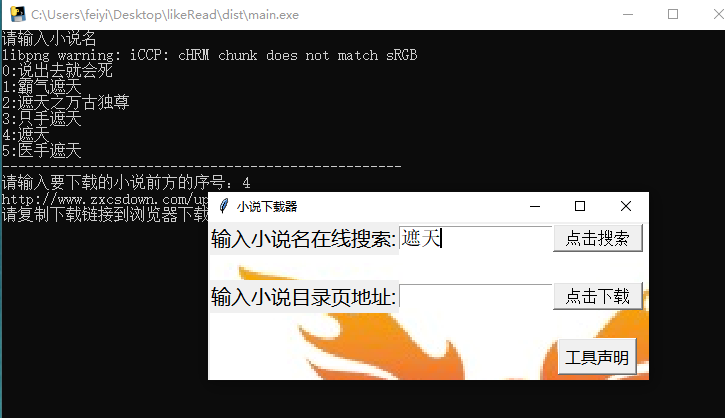

## 特别声明:

* 本脚本仅用于测试和学习研究，禁止用于商业用途，不能保证其合法性，准确性，完整性和有效性，请根据情况自行判断。

* 本项目内所有资源文件，禁止任何公众号、自媒体进行任何形式的转载、发布。

* 本项目内任何脚本问题概不负责，包括但不限于由任何脚本错误导致的任何损失或损害.

* 请勿将项目的任何内容用于商业或非法目的，否则后果自负。

* 本项目遵循`GPL-3.0 License`协议，如果本特别声明与`GPL-3.0 License`协议有冲突之处，以本特别声明为准。

## 简介

1、小说下载(优势：速度快，直接从网络上搜集完整txt文件速度快)
2、在线小说爬取(优势：资源全，已上架的小说几乎都能找到)

## 目前支持爬取的网站

http://www.xbiquge.la/
http://www.biquge.info/
http://www.ikuaiyan.com/
http://www.booksky.cc/
https://www.9biquge.com/
http://www.jjwxc.net/
https://www.taiuu.com/
https://www.shouda8.com/

---

